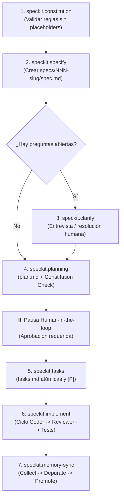

# IA Harness

Harness de desarrollo asistido por IA multi-agente y multi-motor, diseñado bajo los principios de **Spec-Driven Development (SDD)**, **Test-Driven Development (TDD)** y **Graphify-First**.

Este repositorio proporciona una arquitectura física desacoplada y reproducible compatible con:
1. **Gemini / Antigravity Engine** (CLI & Workflows).
2. **OpenCode Engine** (Multi-agent JSONC config & Skills).

---

> [!CAUTION]
> ### 🛑 MANDATO OBLIGATORIO PARA AGENTES IA (Gemini, Antigravity, OpenCode, Claude Code)
>
> **TODO AGENTE IA QUE INTERACTÚE CON ESTE REPOSITORIO DEBE CUMPLIR ESTA REGLA SIN EXCEPCIÓN:**
>
> Antes de realizar cualquier acción, instalación, modificación o ejecución de scripts, **DEBES PREGUNTAR AL USUARIO QUÉ INSTALACIÓN VA A REALIZAR**:
> - **[1] Gemini / Antigravity** (Instala exclusivamente en `~/.gemini/`)
> - **[2] OpenCode** (Instala exclusivamente en `~/.agents/skills/` y `~/.config/opencode/`)
> - **[3] Ambas** (Instalaciones independientes sin mezclar componentes)
>
> **PROHIBIDO:**
> - Asumir un motor por defecto sin confirmación previa del usuario.
> - Mezclar intenciones o instalar componentes cruzados entre motores.
> - Configurar rutas relativas locales como `./.agents/skills` en proyectos o repositorios analizados.
>
> 📖 **Guía Oficial de Instalación Paso a Paso:**  
> Consulta el protocolo canónico para agentes y humanos en [`INSTALL.md`](file:///c:/Users/ccuero/Desktop/ia-harness/INSTALL.md).

---

## 🏗️ Estructura Limpia del Repositorio

El repositorio presenta una segregación física total entre ambos motores:

```text
ia-harness/
├── gemini/                           # Motor Gemini / Antigravity (completamente aislado)
│   ├── GEMINI.md                     # Entry point global para el orquestador
│   ├── settings.example.json         # Plantilla sanitizada de configuración MCP y hooks
│   ├── README.md                     # Documentación exclusiva de Gemini
│   ├── .agent/
│   │   ├── skills/                   # 26 skills canónicas para subagentes
│   │   └── workflows/                # Ciclo de vida Speckit ejecutable (7 pasos)
│   ├── .specify/                     # Capa de gobernanza (constitution.md y templates)
│   └── hooks/                        # Hooks de runtime de Antigravity (RBAC, context, audit)
│
├── opencode/                         # Motor OpenCode (completamente aislado)
│   ├── opencode.jsonc                # Definición de agentes, permisos, modelos y MCPs
│   ├── AGENTS.md                     # Directrices operativas de OpenCode y protocolos
│   ├── README.md                     # Documentación exclusiva de OpenCode
│   ├── package.json                  # Definición de dependencias y soporte
│   └── .agents/
│       └── skills/                   # Catálogo canónico de 26 skills para OpenCode
│
├── scripts/                          # Scripts interactivos de instalación global en el host
│   ├── install-harness.ps1           # Instalador interactivo para Windows (PowerShell)
│   └── install-harness.sh            # Instalador interactivo para Linux / macOS (Bash)
│
├── INSTALL.md                        # Protocolo canónico de instalación host-level para agentes IA y humanos
└── README.md                         # Este documento de arquitectura unificada y mandatos
```

---

## 💻 Protocolo de Instalación y Runtime a Nivel de Ordenador (Host-Level Setup)

Este repositorio opera bajo el principio de **Distribución Centralizada vs. Ejecución Global en Host**:

```mermaid
flowchart LR
    subgraph Repo["📦 Repositorio ia-harness (Distribución y Aislamiento Físico)"]
        direction TB
        subgraph GeminiSource["gemini/"]
            G_SRC1["gemini/.agent/skills/ (26 skills)"]
            G_SRC2["gemini/.agent/workflows/ (7 workflows)"]
            G_SRC3["gemini/hooks/ (Hooks de runtime)"]
            G_SRC4["gemini/.specify/ (Constitución & Templates)"]
            G_SRC5["gemini/GEMINI.md"]
            G_SRC6["gemini/settings.example.json"]
        end
        subgraph OpenCodeSource["opencode/"]
            O_SRC1["opencode/.agents/skills/ (26 skills)"]
            O_SRC2["opencode/opencode.jsonc"]
            O_SRC3["opencode/AGENTS.md"]
        end
    end

    subgraph Host["💻 Runtime Global en el Host (Máquina del Usuario)"]
        direction TB
        subgraph GeminiPaths["~/.gemini/ (Gemini / Antigravity)"]
            G1["~/.gemini/.agent/skills/"]
            G2["~/.gemini/.agent/workflows/"]
            G3["~/.gemini/hooks/"]
            G4["~/.gemini/.specify/"]
            G5["~/.gemini/GEMINI.md"]
            G6["~/.gemini/settings.json"]
        end
        subgraph OpenCodePaths["Host Global (OpenCode)"]
            O1["~/.agents/skills/"]
            O2["~/.config/opencode/opencode.json"]
        end
    end

    GeminiSource -->|"scripts/install-harness.ps1 [1]\nscripts/install-harness.sh [1]"| GeminiPaths
    OpenCodeSource -->|"scripts/install-harness.ps1 [2]\nscripts/install-harness.sh [2]"| OpenCodePaths
```



### Separación entre Repositorio y Host Runtime

1. **Repositorio `ia-harness` (Distribución y Fuente de Verdad)**:
   - Los motores `gemini/` y `opencode/` residen en carpetas completamente independientes.
   - **No debe utilizarse como runtime directo ni referenciarse con rutas relativas (`./.agents/skills`)** dentro de proyectos de desarrollo o repositorios analizados.
   
2. **Runtime en la Máquina (Host Global Paths)**:
   - **Gemini / Antigravity**: Lee sus directivas, workflows y skills desde `~/.gemini/` (`~/.gemini/.agent/skills/`, `~/.gemini/hooks/`, `~/.gemini/.agent/workflows/`, etc.).
   - **OpenCode**: Resuelve las skills exclusivamente desde `~/.agents/skills/` y su configuración desde `~/.config/opencode/opencode.json`.
   - Garantiza que cualquier proyecto abierto en la máquina del usuario herede instantáneamente todas las habilidades sin ensuciar el repositorio de la aplicación ni duplicar carpetas de skills.

---

## 🛠️ Menú Interactivo e Instalación

> [!IMPORTANT]
> **Guía Oficial de Instalación para Agentes IA y Operadores:**  
> Para consultar la especificación detallada de rutas, variables de entorno, mandatos de enrutamiento y comandos de verificación post-instalación, consulta [`INSTALL.md`](file:///c:/Users/ccuero/Desktop/ia-harness/INSTALL.md).

Al ejecutar el script de instalación sin argumentos, se despliega automáticamente un menú interactivo por consola:

```text
============================================================
         IA HARNESS — INSTALADOR GLOBAL DE RUNTIME         
============================================================
Seleccione el entorno a instalar en este equipo:

  [1] Gemini / Antigravity
  [2] OpenCode
  [3] Ambas (Instalaciones independientes sin mezclar)
  [Q] Salir

Opción [1-3, Q]:
```

### Ejecución Interactiva

- **Windows (PowerShell)**:
  ```powershell
  powershell -ExecutionPolicy Bypass -File .\scripts\install-harness.ps1
  ```
- **Linux / macOS (Bash)**:
  ```bash
  chmod +x ./scripts/install-harness.sh
  ./scripts/install-harness.sh
  ```

### Ejecución Desatendida / CLI Flags

Si se requiere automatizar la instalación o ejecutarla en CI/CD sin interacción:

#### Windows (PowerShell)
```powershell
# Solo Gemini / Antigravity
powershell -ExecutionPolicy Bypass -File .\scripts\install-harness.ps1 -Engine Gemini

# Solo OpenCode
powershell -ExecutionPolicy Bypass -File .\scripts\install-harness.ps1 -Engine OpenCode

# Ambas instalaciones independientes
powershell -ExecutionPolicy Bypass -File .\scripts\install-harness.ps1 -Engine All

# Sobrescribir archivos de configuración existentes
powershell -ExecutionPolicy Bypass -File .\scripts\install-harness.ps1 -Engine All -Force
```

#### Linux / macOS (Bash)
```bash
# Solo Gemini / Antigravity
./scripts/install-harness.sh --engine Gemini

# Solo OpenCode
./scripts/install-harness.sh --engine OpenCode

# Ambas instalaciones independientes
./scripts/install-harness.sh --engine All

# Sobrescribir archivos existentes
./scripts/install-harness.sh --engine All --force
```

---

## 🔄 Flujo Metodológico SDD (Spec-Driven Development)

El ciclo de desarrollo garantiza trazabilidad absoluta, aprobaciones humanas y cero código no probado:



### Principios Fundamentales
1. **Spec before code**: Ninguna tarea de implementación puede iniciar sin que `spec.md` y `plan.md` estén creados y aprobados en `specs/<feature>/`.
2. **Human-in-the-loop**: Tras redactar especificaciones y planes, el sistema pausa para obtener confirmación del humano antes de escribir código.
3. **Graphify-first**: Prohibido usar `grep`, `glob` o `findstr` en bash para análisis de código; la exploración estructural se realiza vía análisis de grafo y AST.
4. **TDD Estricto**: Todo cambio de funcionalidad o corrección requiere una prueba que falle primero (RED) antes de escribir el código mínimo de producción (GREEN) y refactorizar (REFACTOR).
5. **Subagent-only Orchestrator**: El orquestador nunca edita código directamente; delega secuencialmente a subagentes especializados y audita los handbacks.

---

## 🤖 Matriz de Subagentes y Roles

| Agente / Rol | Modo | Skill Principal | Responsabilidades y Permisos |
|---|---|---|---|
| `@orchestrator` / `@Leader` | Primary | `orchestrator` | Secuencia el flujo SDD, delega tareas, no toca código, valida handbacks. |
| `@spec-writer` | Subagent | `spec-writer` | Redacta `spec.md`, `plan.md` y `tasks.md`. Scope restringido a `specs/**`. |
| `@tester` | Subagent | `test-driven-development` | Escribe pruebas automatizadas que fallan (Fase RED). No escribe código de producción. |
| `@coder` / `@Build` | Subagent | `coder` | Implementa tareas atómicas de `tasks.md`. Ejecuta tests y reporta handback detallado. |
| `@reviewer` | Subagent | `reviewer` | Auditoría de solo lectura contra la constitución y criterios de aceptación. |
| `@task-runner` / `@task-creator` | Subagent | `task_runner` | Automatización y creación de issues estructurados en GitHub. |
| `@memory-keeper` | Subagent | `memory-keeper` | Depuración de observaciones en Engram y promoción hacia el vault de Obsidian. |
| `@pm-technical-lead` | Subagent | `pm_lead` | Gestión de proyectos, análisis de dailys, bloqueos y ruta crítica. |
| `@daily-analysis` | Subagent | `daily_analysis` | Generación de reportes ejecutivos consolidados diarios y semanales. |
| `@clean-code-auditor` | Subagent | `solid` | Auditoría de principios SOLID, acoplamiento y calidad estructural. |
| `@frontend-architect` | Subagent | `frontend-design` | Arquitectura visual, UI components y design systems. |
| `@interface-design` | Subagent | `interface-design` | Dashboards, herramientas SaaS y diseño de interacción de producto. |
| `@motion-gsap-expert` | Subagent | `gsap` | Animaciones web avanzadas y timelines interactivos. |
| `@web-ux-scraper` | Subagent | `web-ux-scraper` | Extracción e inspección UX mediante Puppeteer. |

---

## 🧠 Arquitectura de Memoria Dual

El harness integra dos capas de memoria complementarias:

### 1. Engram (Memoria Flash / Sesión)
- **Propósito**: Caché de trabajo de alta velocidad y baja latencia para la sesión actual.
- **Herramientas**: `mem_save`, `mem_search`, `mem_context`, `mem_review`, `mem_judge`.
- **Comportamiento**: Se consulta al iniciar una tarea o sesión para recuperar contexto previo; almacena observaciones técnicas y decisiones tácticas.

### 2. Obsidian Second Brain (Memoria Duradera)
- **Propósito**: Almacenamiento persistente de conocimiento, arquitectura y lecciones aprendidas.
- **Protocolo `speckit.memory-sync`**:
  1. **Collect**: Agrupa observaciones guardadas durante el feature.
  2. **Depurate**: Ejecuta comparación y arbitraje para resolver contradicciones y eliminar duplicados.
  3. **Promote**: Promociona el conocimiento duradero hacia el vault de Obsidian (`OBSIDIAN_VAULT_PATH`).

---

## 📦 Catálogo de Skills Canónicas

Las 26 skills canónicas se distribuyen de forma aislada en `gemini/.agent/skills/` y `opencode/.agents/skills/`. Al instalarse mediante los scripts de setup, son desplegadas globalmente en el host (`~/.gemini/.agent/skills/` para Gemini y `~/.agents/skills/` para OpenCode):

### Roles y Metodología
- [`orchestrator`](file:///c:/Users/ccuero/Desktop/ia-harness/opencode/.agents/skills/orchestrator/SKILL.md): Gobernanza de orquestación pura y despacho.
- [`coder`](file:///c:/Users/ccuero/Desktop/ia-harness/opencode/.agents/skills/coder/SKILL.md): Implementación disciplinada tarea por tarea.
- [`reviewer`](file:///c:/Users/ccuero/Desktop/ia-harness/opencode/.agents/skills/reviewer/SKILL.md): Revisión rigurosa de diffs y verificación de pruebas.
- [`spec-writer`](file:///c:/Users/ccuero/Desktop/ia-harness/opencode/.agents/skills/spec-writer/SKILL.md): Creación de especificaciones, planes y checklists.
- [`task_runner`](file:///c:/Users/ccuero/Desktop/ia-harness/opencode/.agents/skills/task_runner/SKILL.md): Generación y sincronización de GitHub Issues estándar.
- [`memory-keeper`](file:///c:/Users/ccuero/Desktop/ia-harness/opencode/.agents/skills/memory-keeper/SKILL.md): Higiene y promoción de memoria duradera.
- [`pm_lead`](file:///c:/Users/ccuero/Desktop/ia-harness/opencode/.agents/skills/pm_lead/SKILL.md): Análisis de proyectos, dependencias y riesgos técnicos.
- [`daily_analysis`](file:///c:/Users/ccuero/Desktop/ia-harness/opencode/.agents/skills/daily_analysis/SKILL.md): Transformación de actividad en reportes ejecutivos.
- [`agile-delivery-governance`](file:///c:/Users/ccuero/Desktop/ia-harness/opencode/.agents/skills/agile-delivery-governance/SKILL.md): Control de proyectos con matrices Tarea-Responsable-Tiempo-Entregable.

### Ingeniería de Software y Testing
- [`subagent-driven-development`](file:///c:/Users/ccuero/Desktop/ia-harness/opencode/.agents/skills/subagent-driven-development/SKILL.md): Despacho de subagentes con ledger, briefs y loop de fixes.
- [`test-driven-development`](file:///c:/Users/ccuero/Desktop/ia-harness/opencode/.agents/skills/test-driven-development/SKILL.md): Ciclo Red-Green-Refactor estricto y buenas prácticas de test.
- [`systematic-debugging`](file:///c:/Users/ccuero/Desktop/ia-harness/opencode/.agents/skills/systematic-debugging/SKILL.md): Investigación de causa raíz, bisección y defensa en profundidad.
- [`verification-before-completion`](file:///c:/Users/ccuero/Desktop/ia-harness/opencode/.agents/skills/verification-before-completion/SKILL.md): Validación de evidencia real antes de emitir claims de éxito.
- [`solid`](file:///c:/Users/ccuero/Desktop/ia-harness/opencode/.agents/skills/solid/SKILL.md): Principios de diseño orientado a objetos y desacoplamiento.
- [`vertical-slice-architecture`](file:///c:/Users/ccuero/Desktop/ia-harness/opencode/.agents/skills/vertical-slice-architecture/SKILL.md): Organización por features y casos de uso de negocio.
- [`graphify`](file:///c:/Users/ccuero/Desktop/ia-harness/opencode/.agents/skills/graphify/SKILL.md): Análisis estructural y navegación por grafos de código.

### Diseño y Frontend
- [`frontend-design`](file:///c:/Users/ccuero/Desktop/ia-harness/opencode/.agents/skills/frontend-design/SKILL.md): Diseño estético de interfaces, landings y componentes UI.
- [`interface-design`](file:///c:/Users/ccuero/Desktop/ia-harness/opencode/.agents/skills/interface-design/SKILL.md): Experiencia de usuario en dashboards y aplicaciones web.
- [`gsap`](file:///c:/Users/ccuero/Desktop/ia-harness/opencode/.agents/skills/gsap/SKILL.md): Animaciones avanzadas y ScrollTrigger con GreenSock.

---

## 🔌 Servidores MCP Integrados

El archivo [`gemini/settings.example.json`](file:///c:/Users/ccuero/Desktop/ia-harness/gemini/settings.example.json) y la configuración de `opencode/opencode.jsonc` definen los servidores MCP requeridos:

| Servidor MCP | Comando / Paquete | Función |
|---|---|---|
| **Obsidian** | `uv run --with "mcp<2" python server.py` | Memoria permanente en el vault Obsidian |
| **Engram** | `engram mcp` | Memoria flash de sesión y aprendizaje adaptativo |
| **GitHub** | `@modelcontextprotocol/server-github` | Gestión de issues, ramas y pull requests |
| **Puppeteer** | `@modelcontextprotocol/server-puppeteer` | Automatización de navegador y captura de pantallas |
| **Chrome DevTools** | `chrome-devtools-mcp@latest` | Inspección de runtime, consola y red web |
| **Next DevTools** | `next-devtools-mcp@latest` | Inspección y diagnóstico de proyectos Next.js |
| **NotebookLM** | `notebooklm-mcp@latest` | Consulta de cuadernos y fuentes documentales |

---

## 🚀 Guía de Inicio Rápido

1. **Instalación Global del Runtime en la Máquina**:
   - Sigue el protocolo en [`INSTALL.md`](file:///c:/Users/ccuero/Desktop/ia-harness/INSTALL.md) o ejecuta directamente el instalador correspondiente:
   - En **Windows (PowerShell)**:
     ```powershell
     powershell -ExecutionPolicy Bypass -File .\scripts\install-harness.ps1
     ```
   - En **Linux / macOS (Bash)**:
     ```bash
     chmod +x ./scripts/install-harness.sh && ./scripts/install-harness.sh
     ```
2. **Selecciona tu motor en el menú interactivo** (`1` para Gemini, `2` para OpenCode, `3` para Ambas).
3. **Configuración de Variables de Entorno**:
   ```bash
   export GITHUB_TOKEN="tu_personal_access_token"
   ```
4. **Configuración de Ajustes de MCP**:
   - Para Gemini: Copia `gemini/settings.example.json` a `~/.gemini/settings.json`.
   - Para OpenCode: Ajusta `~/.config/opencode/opencode.json`.
5. **Verificación de la Constitución**:
   - Asegúrate de que `.specify/memory/constitution.md` (en `~/.gemini/.specify/` o en tu proyecto) refleje las reglas de tu equipo.
6. **Ejecución de Motores**:
   - Con **Gemini / Antigravity**: Inicia el orquestador leyendo `~/.gemini/GEMINI.md`.
   - Con **OpenCode**: Inicia `opencode` en cualquier directorio; resolverá las skills y agentes globales de `~/.agents/skills/` y `~/.config/opencode/`.
