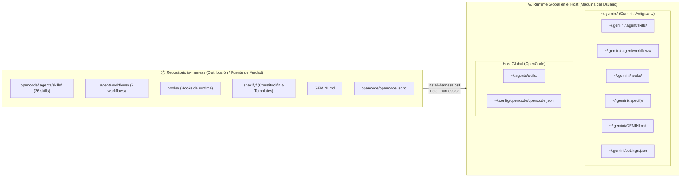
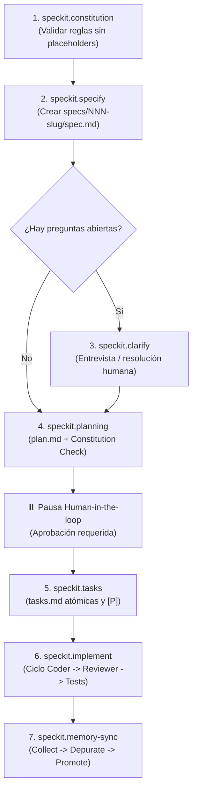

# IA Harness

Harness de desarrollo asistido por IA multi-agente y multi-motor, diseñado bajo los principios de **Spec-Driven Development (SDD)**, **Test-Driven Development (TDD)** y **Graphify-First**.

Este repositorio proporciona un entorno unificado y reproducible compatible simultáneamente con:
1. **Gemini / Antigravity Engine** (CLI & Workflows).
2. **OpenCode Engine** (Multi-agent JSONC config & Skills).

---

## 🏗️ Arquitectura Dual-Engine

El harness comparte una base de especificaciones, constitución y workflows, desacoplando la lógica de negocio de los clientes de ejecución:

```text
ia-harness/
├── .specify/                         # Capa de Gobernanza Compartida
│   ├── memory/
│   │   └── constitution.md           # Reglas no negociables (TDD, Specs, Graphify)
│   └── templates/                    # Plantillas oficiales de ingeniería
│       ├── spec-template.md          # Estructura de requerimientos y criterios
│       ├── plan-template.md          # Enfoque técnico y checklist de constitución
│       └── tasks-template.md         # Desglose de tareas atómicas y handback
│
├── .agent/
│   └── workflows/                    # Ciclo de vida Speckit ejecutable (7 pasos)
│       ├── speckit.constitution.md
│       ├── speckit.specify.md
│       ├── speckit.clarify.md
│       ├── speckit.planning.md
│       ├── speckit.tasks.md
│       ├── speckit.implement.md
│       └── speckit.memory-sync.md
│
├── hooks/                            # Hooks de Runtime de Antigravity / Gemini
│   ├── session-start.ps1             # Context pipeline (inyecta constitución y reglas)
│   ├── before-tool.ps1               # RBAC dispatcher (bloquea comandos peligrosos)
│   └── after-tool.ps1                # Auditoría de ejecución de herramientas
│
├── scripts/                          # Scripts de instalación global en el host
│   ├── install-harness.ps1           # Instalador para Windows (PowerShell)
│   └── install-harness.sh            # Instalador para Linux / macOS (Bash)
│
├── GEMINI.md                         # Entry point para Gemini / Antigravity
├── settings.example.json             # Plantilla sanitizada de configuración MCP y hooks
│
└── opencode/                         # Motor OpenCode
    ├── opencode.jsonc                # Definición de agentes, permisos y MCPs
    ├── AGENTS.md                     # Directrices operativas de OpenCode
    └── .agents/skills/               # Catálogo canónico de skills de distribución (26 skills)
```

---

## 💻 Protocolo de Instalación y Runtime a Nivel de Ordenador (Host-Level Setup)

Este repositorio opera bajo el principio de **Distribución Centralizada vs. Ejecución Global en Host**:



### Separación entre Repositorio y Host Runtime

1. **Repositorio `ia-harness` (Distribución y Fuente de Verdad)**:
   - Contiene la definición oficial y canónica de las 26 skills, los 7 workflows de Speckit, los hooks operacionales, plantillas y archivos de gobernanza.
   - **No debe utilizarse como runtime directo ni referenciarse con rutas relativas (`./.agents/skills`)** dentro de proyectos de desarrollo o repositorios analizados.
   
2. **Runtime en la Máquina (Host Global Paths)**:
   - **Gemini / Antigravity**: Lee sus directivas, workflows y skills desde `~/.gemini/` (`~/.gemini/.agent/skills/`, `~/.gemini/hooks/`, `~/.gemini/.agent/workflows/`, etc.).
   - **OpenCode**: Resuelve las skills exclusivamente desde `~/.agents/skills/` y su configuración desde `~/.config/opencode/opencode.json`.
   - Garantiza que cualquier proyecto que abras en tu equipo herede instantáneamente todas las habilidades sin ensuciar el repositorio de la aplicación ni duplicar carpetas de skills.

### ⚠️ Instrucciones para Agentes de IA

Si eres un modelo de lenguaje o agente autónomo (Antigravity, Gemini CLI, OpenCode, Claude Code) interactuando con este repositorio:
- **NUNCA** configures rutas relativas `./.agents/skills` en archivos de proyecto ni intentes resolver skills desde el directorio de trabajo local del proyecto analizado.
- **Antes de comenzar a operar en una máquina**, debes asegurarte de que los assets del harness se encuentren instalados en las rutas globales del usuario (`~/.gemini/` y `~/.agents/skills/`).
- Si detectas que las rutas globales no existen o faltan skills, ejecuta el script instalador correspondiente a la plataforma (`scripts/install-harness.ps1` en Windows o `scripts/install-harness.sh` en Linux/macOS).

### Scripts de Instalación Automatizada

El repositorio incluye instaladores idempotentes para Windows y sistemas Unix:

#### Windows (PowerShell)
```powershell
# Instalar todo (Gemini + OpenCode)
powershell -ExecutionPolicy Bypass -File .\scripts\install-harness.ps1

# Instalar solo para Gemini / Antigravity
powershell -ExecutionPolicy Bypass -File .\scripts\install-harness.ps1 -Engine Gemini

# Instalar solo para OpenCode
powershell -ExecutionPolicy Bypass -File .\scripts\install-harness.ps1 -Engine OpenCode

# Sobrescribir archivos de configuración existentes (settings.json / opencode.json)
powershell -ExecutionPolicy Bypass -File .\scripts\install-harness.ps1 -Force
```

#### Linux / macOS (Bash)
```bash
# Dar permisos de ejecución
chmod +x ./scripts/install-harness.sh

# Instalar todo (Gemini + OpenCode)
./scripts/install-harness.sh

# Instalar solo para Gemini
./scripts/install-harness.sh --engine Gemini

# Instalar solo para OpenCode
./scripts/install-harness.sh --engine OpenCode

# Sobrescribir archivos existentes
./scripts/install-harness.sh --force
```

---

## 🔄 Flujo Metodológico SDD (Spec-Driven Development)

El ciclo de desarrollo garantiza trazabilidad absoluta, aprobaciones humanas y cero código no probado:



### Principios Fundamentales
1. **Spec before code**: Ninguna tarea de implementación puede iniciar sin que `spec.md` y `plan.md` estén creados y aprobados en `specs/<feature>/`.
2. **Human-in-the-loop**: Tras redactar especificaciones y planes, el sistema pausa para obtener confirmación del humano antes de escribir código.
3. **Graphify-first**: Prohibido usar `grep`, `glob` o `findstr` en bash para análisis de código; la exploración estructural se realiza vía análisis de grafo y AST.
4. **TDD Estricto**: Todo cambio de funcionalidad o corrección requiere una prueba que falle primero (RED) antes de escribir el código mínimo de producción (GREEN) y refactorizar (REFACTOR).
5. **Subagent-only Orchestrator**: El orquestador nunca edita código directamente; delega secuencialmente a subagentes especializados y audita los handbacks.

---

## 🤖 Matriz de Subagentes y Roles

| Agente / Rol | Modo | Skill Principal | Responsabilidades y Permisos |
|---|---|---|---|
| `@orchestrator` / `@Leader` | Primary | `orchestrator` | Secuencia el flujo SDD, delega tareas, no toca código, valida handbacks. |
| `@spec-writer` | Subagent | `spec-writer` | Redacta `spec.md`, `plan.md` y `tasks.md`. Scope restringido a `specs/**`. |
| `@tester` | Subagent | `test-driven-development` | Escribe pruebas automatizadas que fallan (Fase RED). No escribe código de producción. |
| `@coder` / `@Build` | Subagent | `coder` | Implementa tareas atómicas de `tasks.md`. Ejecuta tests y reporta handback detallado. |
| `@reviewer` | Subagent | `reviewer` | Auditoría de solo lectura contra la constitución y criterios de aceptación. |
| `@task-runner` / `@task-creator` | Subagent | `task_runner` | Automatización y creación de issues estructurados en GitHub. |
| `@memory-keeper` | Subagent | `memory-keeper` | Depuración de observaciones en Engram y promoción hacia el vault de Obsidian. |
| `@pm-technical-lead` | Subagent | `pm_lead` | Gestión de proyectos, análisis de dailys, bloqueos y ruta crítica. |
| `@daily-analysis` | Subagent | `daily_analysis` | Generación de reportes ejecutivos consolidados diarios y semanales. |
| `@clean-code-auditor` | Subagent | `solid` | Auditoría de principios SOLID, acoplamiento y calidad estructural. |
| `@frontend-architect` | Subagent | `frontend-design` | Arquitectura visual, UI components y design systems. |
| `@interface-design` | Subagent | `interface-design` | Dashboards, herramientas SaaS y diseño de interacción de producto. |
| `@motion-gsap-expert` | Subagent | `gsap` | Animaciones web avanzadas y timelines interactivos. |
| `@web-ux-scraper` | Subagent | `web-ux-scraper` | Extracción e inspección UX mediante Puppeteer. |

---

## 🧠 Arquitectura de Memoria Dual

El harness integra dos capas de memoria complementarias:

### 1. Engram (Memoria Flash / Sesión)
- **Propósito**: Caché de trabajo de alta velocidad y baja latencia para la sesión actual.
- **Herramientas**: `mem_save`, `mem_search`, `mem_context`, `mem_review`, `mem_judge`.
- **Comportamiento**: Se consulta al iniciar una tarea o sesión para recuperar contexto previo; almacena observaciones técnicas y decisiones tácticas.

### 2. Obsidian Second Brain (Memoria Duradera)
- **Propósito**: Almacenamiento persistente de conocimiento, arquitectura y lecciones aprendidas.
- **Protocolo `speckit.memory-sync`**:
  1. **Collect**: Agrupa observaciones guardadas durante el feature.
  2. **Depurate**: Ejecuta comparación y arbitraje para resolver contradicciones y eliminar duplicados.
  3. **Promote**: Promociona el conocimiento duradero hacia el vault de Obsidian (`OBSIDIAN_VAULT_PATH`).

---

## 📦 Catálogo de Skills Canónicas

Las 26 skills canónicas residen para distribución en `opencode/.agents/skills/`. Al instalarse mediante los scripts de setup, son desplegadas globalmente en el host (`~/.gemini/.agent/skills/` para Gemini y `~/.agents/skills/` para OpenCode):

### Roles y Metodología
- [`orchestrator`](file:///c:/Users/ccuero/Desktop/ia-harness/opencode/.agents/skills/orchestrator/SKILL.md): Gobernanza de orquestación pura y despacho.
- [`coder`](file:///c:/Users/ccuero/Desktop/ia-harness/opencode/.agents/skills/coder/SKILL.md): Implementación disciplinada tarea por tarea.
- [`reviewer`](file:///c:/Users/ccuero/Desktop/ia-harness/opencode/.agents/skills/reviewer/SKILL.md): Revisión rigurosa de diffs y verificación de pruebas.
- [`spec-writer`](file:///c:/Users/ccuero/Desktop/ia-harness/opencode/.agents/skills/spec-writer/SKILL.md): Creación de especificaciones, planes y checklists.
- [`task_runner`](file:///c:/Users/ccuero/Desktop/ia-harness/opencode/.agents/skills/task_runner/SKILL.md): Generación y sincronización de GitHub Issues estándar.
- [`memory-keeper`](file:///c:/Users/ccuero/Desktop/ia-harness/opencode/.agents/skills/memory-keeper/SKILL.md): Higiene y promoción de memoria duradera.
- [`pm_lead`](file:///c:/Users/ccuero/Desktop/ia-harness/opencode/.agents/skills/pm_lead/SKILL.md): Análisis de proyectos, dependencias y riesgos técnicos.
- [`daily_analysis`](file:///c:/Users/ccuero/Desktop/ia-harness/opencode/.agents/skills/daily_analysis/SKILL.md): Transformación de actividad en reportes ejecutivos.
- [`agile-delivery-governance`](file:///c:/Users/ccuero/Desktop/ia-harness/opencode/.agents/skills/agile-delivery-governance/SKILL.md): Control de proyectos con matrices Tarea-Responsable-Tiempo-Entregable.

### Ingeniería de Software y Testing
- [`subagent-driven-development`](file:///c:/Users/ccuero/Desktop/ia-harness/opencode/.agents/skills/subagent-driven-development/SKILL.md): Despacho de subagentes con ledger, briefs y loop de fixes.
- [`test-driven-development`](file:///c:/Users/ccuero/Desktop/ia-harness/opencode/.agents/skills/test-driven-development/SKILL.md): Ciclo Red-Green-Refactor estricto y buenas prácticas de test.
- [`systematic-debugging`](file:///c:/Users/ccuero/Desktop/ia-harness/opencode/.agents/skills/systematic-debugging/SKILL.md): Investigación de causa raíz, bisección y defensa en profundidad.
- [`verification-before-completion`](file:///c:/Users/ccuero/Desktop/ia-harness/opencode/.agents/skills/verification-before-completion/SKILL.md): Validación de evidencia real antes de emitir claims de éxito.
- [`solid`](file:///c:/Users/ccuero/Desktop/ia-harness/opencode/.agents/skills/solid/SKILL.md): Principios de diseño orientado a objetos y desacoplamiento.
- [`vertical-slice-architecture`](file:///c:/Users/ccuero/Desktop/ia-harness/opencode/.agents/skills/vertical-slice-architecture/SKILL.md): Organización por features y casos de uso de negocio.
- [`graphify`](file:///c:/Users/ccuero/Desktop/ia-harness/opencode/.agents/skills/graphify/SKILL.md): Análisis estructural y navegación por grafos de código.

### Diseño y Frontend
- [`frontend-design`](file:///c:/Users/ccuero/Desktop/ia-harness/opencode/.agents/skills/frontend-design/SKILL.md): Diseño estético de interfaces, landings y componentes UI.
- [`interface-design`](file:///c:/Users/ccuero/Desktop/ia-harness/opencode/.agents/skills/interface-design/SKILL.md): Experiencia de usuario en dashboards y aplicaciones web.
- [`gsap`](file:///c:/Users/ccuero/Desktop/ia-harness/opencode/.agents/skills/gsap/SKILL.md): Animaciones avanzadas y ScrollTrigger con GreenSock.

---

## 🔌 Servidores MCP Integrados

El archivo [`settings.example.json`](file:///c:/Users/ccuero/Desktop/ia-harness/settings.example.json) define la configuración de servidores MCP requeridos:

| Servidor MCP | Comando / Paquete | Función |
|---|---|---|
| **Obsidian** | `uv run --with "mcp<2" python server.py` | Memoria permanente en el vault Obsidian |
| **Engram** | `engram mcp` | Memoria flash de sesión y aprendizaje adaptativo |
| **GitHub** | `@modelcontextprotocol/server-github` | Gestión de issues, ramas y pull requests |
| **Puppeteer** | `@modelcontextprotocol/server-puppeteer` | Automatización de navegador y captura de pantallas |
| **Chrome DevTools** | `chrome-devtools-mcp@latest` | Inspección de runtime, consola y red web |
| **Next DevTools** | `next-devtools-mcp@latest` | Inspección y diagnóstico de proyectos Next.js |
| **NotebookLM** | `notebooklm-mcp@latest` | Consulta de cuadernos y fuentes documentales |

---

## 🚀 Guía de Inicio Rápido

1. **Instalación Global del Runtime en la Máquina**:
   - En **Windows (PowerShell)**:
     ```powershell
     powershell -ExecutionPolicy Bypass -File .\scripts\install-harness.ps1
     ```
   - En **Linux / macOS (Bash)**:
     ```bash
     chmod +x ./scripts/install-harness.sh && ./scripts/install-harness.sh
     ```
2. **Configuración de Variables de Entorno**:
   ```bash
   export GITHUB_TOKEN="tu_personal_access_token"
   ```
3. **Configuración de Ajustes de MCP**:
   - Copia `settings.example.json` a tu configuración de Antigravity (`~/.gemini/settings.json`) o adapta las variables en `opencode/opencode.jsonc`.
4. **Verificación de la Constitución**:
   - Asegúrate de que `.specify/memory/constitution.md` refleje las reglas de tu proyecto antes de comenzar cualquier sprint.
5. **Ejecución de Motores**:
   - Con **Gemini / Antigravity**: Inicia el orquestador leyendo `~/.gemini/GEMINI.md`.
   - Con **OpenCode**: Inicia `opencode` en cualquier directorio; resolverá las skills y agentes globales de `~/.agents/skills/` y `~/.config/opencode/`.
